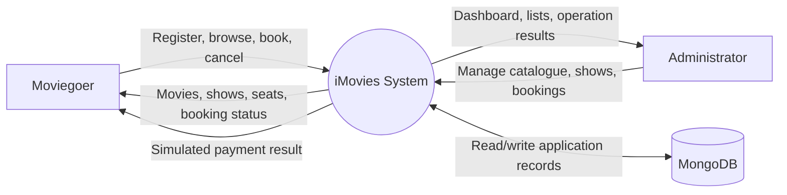
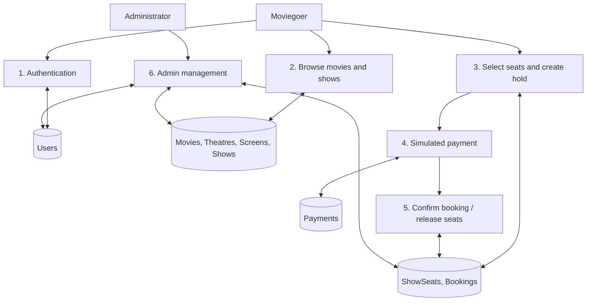

# Data Flow Diagram

## Level 0 — Context diagram

```mermaid
flowchart LR
  U[Moviegoer] -->|Register, browse, book, cancel| APP((iMovies System))
  APP -->|Movies, shows, seats, booking status| U
  A[Administrator] -->|Manage catalogue, shows, bookings| APP
  APP -->|Dashboard, lists, operation results| A
  APP <--> |Read/write application records| DB[(MongoDB)]
  APP -->|Simulated payment result| U
```

## Level 1 — Main processes

```mermaid
flowchart TD
  U[Moviegoer] --> P1[1. Authentication]
  U --> P2[2. Browse movies and shows]
  U --> P3[3. Select seats and create hold]
  P1 <--> D1[(Users)]
  P2 <--> D2[(Movies, Theatres, Screens, Shows)]
  P3 <--> D3[(ShowSeats, Bookings)]
  P3 --> P4[4. Simulated payment]
  P4 <--> D4[(Payments)]
  P4 --> P5[5. Confirm booking / release seats]
  P5 <--> D3
  A[Administrator] --> P6[6. Admin management]
  P6 <--> D1
  P6 <--> D2
  P6 <--> D3
```

These are high-level documentation diagrams; adjust them if a formal departmental notation is required.
